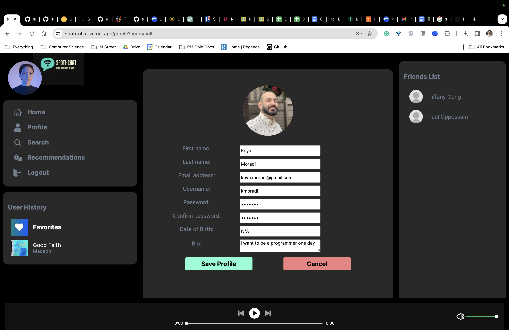
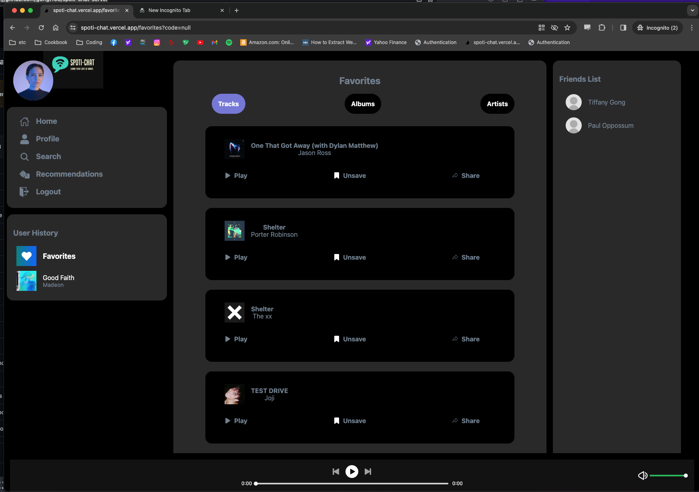

# `Spoti-chat`

Share your love of music!

## What is it?

Travel Map uses the Google Maps API to plot bookmark pins so that you can easily see your saved destinations.

Spoti-Chat uses Spotify API, and allows you to do the following:

- Listen to music
- Search for songs
- Search for Recommended songs
- Add Search and Recommended songs to Favorites
- Chat with your friends

## Installation Instructions

1. Fork and clone this repository.
2. Run `npm install` from your terminal while inside of the project's directory.
   3A. Set up a `.env` file and add `NEXT_PUBLIC_HEROKU_SERVER_URL=https://spoti-chat-41fc1f2f3950.herokuapp.com` and `NEXT_PUBLIC_LOCAL_SERVER_URL=http://localhost:8000`
   3B. It's important to note that your Spotify API key comes from the Spotify Developer website `https://developer.spotify.com/`
3. You don't have to create the database in the server because you're connecting through our URL. So just run `npm run dev` on your front end with `http://localhost:3000/` in terminal
4. Run your server using `npm run dev` and access the app through the port specified in `server.js`.

### Using the App

#### Login

Users are automatically redirected here if they are not logged in.

#### Signup

Users are automatically redirected here if they are not logged in to Spotify.

Users can create an account here if they do not have one or wish create another one. Once the user submits the signup form, the following validations occur:

- App checks to see if there are other users using the same email before creating the account.
- Inputted password is verified so that it is valid. It also verifies that the same password is inputted twice.
- Password is encrypted before it's stored in the database.

#### Spotify Login

Users are automatically redirected here if they are not logged in to Spotify.

#### Homepage

This page displays the following:

1. A vertical sidebar navigation on the left
2. A text-box at the top-center of the page
3. A newsfeed central to the page that contains all the user activity
4. Vertical friends-list side-bar on the right
5. Music player at the bottom

#### Profile

Users will be able to view their profile page, which contains their photo, and relevant user information based on the schema outline in Mongo DB for signing up

### Edit Profile

Users will be able to edit their profile page, which contains their photo, and relevant user information based on the schema outline in Mongo DB for signing up

### Friend Profile

Users will be able to edit their profile page, which contains their photo, and relevant user information based on the schema outline in Mongo DB for signing up

#### Search

Users can search for any song they want using the `search` feature in the Spotify API inside the Spoti-chat app. Users can search songs based on album, track, or artist.

#### Recommendation

Users will be able to view songs recommended by the Spotofy API from their user profile using the `recommendation` feature of the Spotify API.

#### Favorites

Users will save the outputs of their favorite songs, AFTER using the 'recommendation' and 'search' feature from the Spotify API inside the spoti-chat app. Users can get songs recommended to them based on album, track, or artist.

### Stretch Goal

1. Chat feature on vercel

- Currently works if you run your backend server on your terminal. However, it is not hosted on Heroku.
- Users can communicate with one another through chat, either privately or publicly.

2. Adding friends, and a friends-list page

- Users can add friends by searching for them through an autocomplete searchbar or clicking on suggested friends.

3. AI-based song recommendation based on mood

- Our goal here was to use an AI that uses the `recommendation' feature to recommend songs. This added few layers of complexity in building our app. So added it as a stretch goal.
